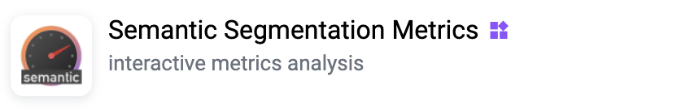

# Semantic Segmentation Metrics

  <a href="#Overview">Overview</a> •
  <a href="#Usage">Usage</a> •
  <a href="#demo-data">Demo Data</a> •
  <a href="#how-to-run">How To Run</a> •
  <a href="#screenshot">Screenshot</a> 

# Overview
Application allows  you to make Quality Assurance in Semantic Segmentation task.

Application key points:

- Interactive visualizations 
- Interactive filters for Images Table
- Calculates metrics (Accuracy, IoU):
    - for whole project
    - for each dataset
    - for each image
    - for each class
- Calculates Matched Pixels Matrix:
    - for whole projects
    - for each image
- Does not change the original projects
- Automatically converts Projects to Semantic Segmentation task 
- Automatically labels all unlabeled pixels as background (`__bg__`)  

# Usage

📋 Content:

* <a href="#step-1--select-projects">Step 1 — Select Projects</a>
* <a href="#step-2--select-datasets">Step 2 — Select Datasets</a>
* <a href="#step-3--select-classes">Step 3 — Select Classes</a>
* <a href="#step-4--metrics-dashboard">Step 4 — Metrics Dashboard</a>

### Step 1 — Select Projects

Select Ground Truth and Predicted projects.   
Application converts projects to Segmentation Task (does not change the originals).

### Step 2 — Select Datasets

Select datasets to analyse.  
Unmatched images (by image name or image hash) will be automatically skipped.

### Step 3 — Select Classes

Select classes to analyse.  
Unmatched images (if there are no masks on both images) will be automatically skipped.

### Step 4 — Metrics Dashboard

Metrics dashboard splits into two parts: **Statistics Review Interface** and **Images Review Interface**.

#### 4.1 Statistics Review Interface

That interface allows you to check statistics.  
Please note — all cells on widgets are clickable.  
That means you can use Matched Pixels Matrix, Statistics by Classes or Statistics by Datasets as interactive filters for Images Table.

1. Click on a cell of the Matched Pixels Matrix — will show you items which must contains GT class on GT image and PRED class on PRED image.
2. Click on a row of the Statistics by Classes — will show you items which contains selected class on both GT and PRED images.
3. Click on a row of the Statistics by Datasets — will show you items filtered by selected Dataset.

You also can open Images Table without any filters — just click on **Open Images Review Interface Without Filters** button.

#### 4.2 Images Review Interface

That interface allows you to analyse results on images level.  
Images table contains all matched (by name, hash, masks exists on both images) images of GT and PRED projects.
You also can apply filter to the table using Statistics Review Interface.

Click on a row to open Visualization Results for item. 
Visualization Results allows you to see the difference between GT and PRED masks.

By default, Visualization Results will show you results for all classes on images,  
but you can easily analyse each specific class clicking by a cell of Matrix.  
Matched Pixels will be highlighted as green, unmatched — as red.

# Demo Data

You can use demo data to test Semantic Segmentation Metrics application:

- [PascalVOC GT Masks (Sample)](https://ecosystem.supervise.ly/projects/pascal-sample-gt-masks) — Ground Truth example project    
        
  
- [PascalVOC PRED Masks (Sample)](https://ecosystem.supervise.ly/projects/pascal-sample-pred-masks) — Predictions-Labeled example project   
    

# How To Run

1. Prepare **GT Project** and **PRED Project**, you can use <a href="#demo-data">demo data</a> for test try. 

2. Add [Semantic Segmentation Metrics](https://ecosystem.supervise.ly/apps/supervisely-ecosystem/semantic-segmentation-metrics-dashboard) application to your Team

3. Launch from Plugin && Apps menu

# Screenshot

